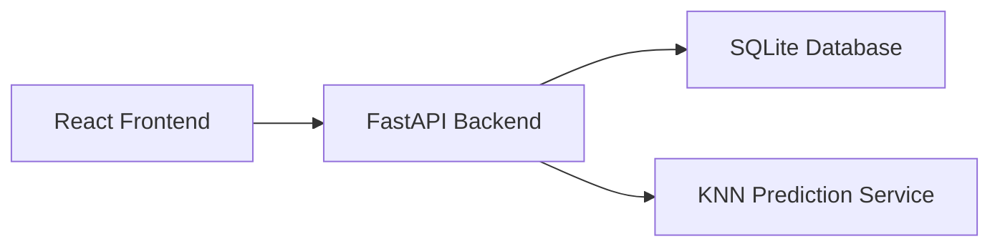

# Architecture

## High-Level View

## Backend Layers

- Routers expose HTTP endpoints.
- Schemas validate request and response payloads.
- Services contain business logic.
- Models define SQLAlchemy ORM entities.
- Core modules hold shared infrastructure such as authentication dependencies.

