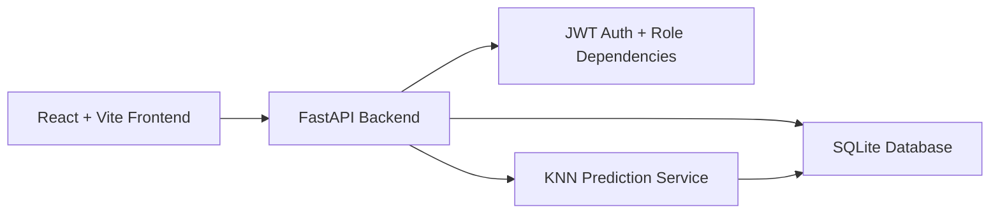
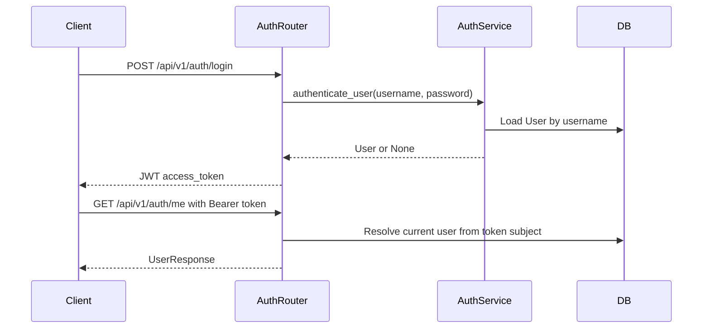
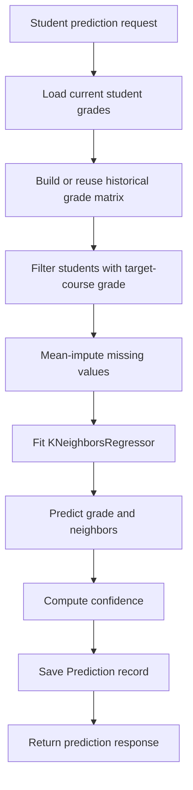

# Architecture

## High-Level View

## Backend Layers

- Routers expose HTTP endpoints under `/api/v1`.
- Schemas define Pydantic request and response DTOs.
- Services contain business logic and database queries.
- Models define SQLAlchemy 2.0 ORM entities.
- Core modules provide security, JWT handling, and FastAPI dependencies.
- Scripts provide local operational tasks such as synthetic data seeding.

## Runtime Flow

1. The frontend sends requests to the FastAPI backend.
2. Protected endpoints use bearer tokens with `get_current_user`.
3. Admin endpoints additionally use `require_admin`.
4. Routers validate payloads with Pydantic schemas.
5. Services read/write SQLAlchemy ORM models through a request-scoped DB session.
6. Prediction routes call the KNN service, which reads historical data and saves prediction results.

## Authentication Architecture

## Prediction Architecture

## Database

The database is SQLite at `./grade_prediction.db`. SQLAlchemy creates tables at app startup using `Base.metadata.create_all(bind=engine)`.

Main tables:

- `users`
- `courses`
- `student_grades`
- `historical_students`
- `historical_grades`
- `predictions`
- `system_settings`

## Frontend Architecture Status

The frontend currently has a Vite/React scaffold with placeholder pages and API helper files. The planned frontend will use:

- React Router for page routing.
- Axios API helpers for backend calls.
- Auth context for token/user state.
- Bootstrap 5 with RTL styling.
- Separate page stages to avoid mixing student and admin screens.

## UML Files

The files in `docs/uml` currently exist as placeholder PNGs only. They are not real UML diagrams yet and should be regenerated later from the implemented system design.
